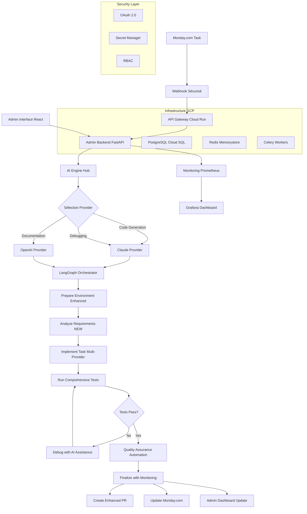

# Flux de Travail Détaillé : De la Tâche à la Pull Request
## Version Révisée avec Architecture Multi-Provider et Administration

Le processus peut être visualisé comme une **usine intelligente automatisée** pour le code. Chaque station de l'usine est un service spécialisé avec redondance et monitoring, et LangGraph est le **système de contrôle industriel** qui orchestre le tout avec une interface d'administration complète.

---

## **Étape 1 : Le Déclenchement Intelligent (Point de Départ)**

- **Acteur** : Le développeur humain ou automatisation métier.
- **Interface** : **Monday.com** avec validation enrichie.
- **Processus** :
    1. Le développeur crée une nouvelle "tâche" dans le tableau Monday.com "Backlog AI-Agent".
    2. Il remplit des colonnes **structurées et validées** :
        - `Titre de la tâche` : Ex: "Ajouter authentification OAuth2 au backend API"
        - `Description Technique` : Brief détaillé avec spécifications, contraintes et critères d'acceptation
        - `Type de Tâche` : Feature/Bug/Refactor/Documentation (pour sélection IA optimale)
        - `Priorité` : Critical/High/Medium/Low (pour allocation ressources)
        - `Repository` : URL du repo GitHub cible
        - `Branche Git` : Ex: `feature/oauth2-backend`
        - `Framework` : React/Node.js/Python/etc. (pour contexte IA)
        - `Statut` : "À faire" → déclenche automatiquement le workflow
    3. **Validation automatique** : L'agent vérifie la complétude et cohérence avant traitement

- **Nouveautés Architecture Révisée** :
    - **Webhook sécurisé** avec authentification et retry automatique
    - **Validation métier** : Vérification format et complétude des données
    - **Monitoring** : Traçabilité complète depuis Monday.com
    - **Configuration admin** : Paramétrage des colonnes via interface web

---

## **Étape 2 : Réception et Orchestration Intelligente**

- **Acteur** : **API Gateway + Admin Backend** (Architecture microservices).
- **Interface** : API REST sécurisée avec load balancing.
- **Processus** :
    1. **Réception sécurisée** :
        - Webhook Monday.com → **Cloud Load Balancer** → **API Gateway (Cloud Run)**
        - Validation signature webhook et authentification
        - Rate limiting et protection DDoS
    
    2. **Traitement intelligent** :
        - Extraction et validation des données JSON
        - **Sélection du provider IA** selon type de tâche via AI Engine Hub
        - Création d'un **workflow unique** avec ID traçable
        - Mise en queue **Celery + Redis** pour traitement asynchrone
    
    3. **Monitoring temps réel** :
        - Envoi métriques vers **Prometheus**
        - Notification **Admin Dashboard** (nouvelle tâche reçue)
        - Logs structurés pour observabilité complète

- **Stack Technique Révisé** :
    - **API Gateway** : Cloud Run (auto-scaling)
    - **Admin Backend** : FastAPI + PostgreSQL sur GKE
    - **Queue Processing** : Celery + Redis Memorystore
    - **Monitoring** : Prometheus + Grafana + Cloud Monitoring
    - **Sécurité** : OAuth 2.0 + JWT + Secret Manager

---

## **Étape 3 : Intelligence Artificielle Multi-Provider (Cerveau Distribué)**

- **Acteur** : **AI Engine Hub** + **LangGraph Orchestrator**.
- **Interface** : Hub IA intelligent avec failover automatique.
- **Processus** :

    ### **3.1 Sélection Intelligente du Provider IA**
    ```python
    # Nouveau système de sélection contextuelle
    if task_type == "code_generation" and language == "Python":
        provider = ai_hub.get_best_provider("code_generation")  # Claude
    elif task_type == "documentation":
        provider = ai_hub.get_best_provider("documentation")    # OpenAI
    elif task_type == "debugging":
        provider = ai_hub.get_best_provider("debugging")        # Claude
    ```

    ### **3.2 Workflow LangGraph Enrichi**
    
    **État Initial Étendu** :
    ```python
    initial_state = {
        'task_info': {...},           # Données Monday.com
        'ai_provider': 'claude',      # Provider sélectionné
        'git_config': {...},          # Configuration Git automatique
        'test_config': {...},         # Configuration tests avancés
        'security_scan': False,       # Flag scan sécurité
        'performance_metrics': {},    # Métriques performance
        'admin_notifications': []     # Notifications admin temps réel
    }
    ```

    ### **Nœuds LangGraph Améliorés** :

    1. **Nœud `prepare_environment_enhanced`** :
        - **Préparation Git automatique** via GitHub API
        - Configuration utilisateur Git automatique
        - Clonage intelligent avec gestion des dépendances
        - Setup environnement (Node.js, Python, Docker selon contexte)
        - **Nouveauté** : Préparation parallélisée et cachée

    2. **Nœud `analyze_requirements`** (NOUVEAU) :
        - **Analyse contextuelle** de la tâche par l'IA
        - Identification des fichiers à modifier
        - Génération du plan d'implémentation détaillé
        - Estimation complexité et temps
        - **Provider IA** : Sélection automatique selon contexte

    3. **Nœud `implement_task_multi_provider`** :
        - **Génération de code** avec provider optimal
        - **Failover automatique** : Si Claude indisponible → OpenAI
        - **Contexte enrichi** : Architecture projet, patterns existants
        - **Qualité** : Respect des standards de code automatique
        - **Notification admin** : Progression temps réel

    4. **Nœud `run_comprehensive_tests`** (RÉVOLUTIONNAIRE) :
        - **Tests unitaires** : Pytest avec coverage automatique
        - **Tests d'intégration** : API et base de données
        - **Smoke tests** : Validation fonctionnement global  
        - **Tests de sécurité** : Bandit, Safety, scan vulnérabilités
        - **Tests de performance** : Validation temps de réponse
        - **Tests E2E** : Selenium/Playwright si configuré
        - **Génération automatique** : L'IA crée les tests manquants

    5. **Nœud `debug_with_ai_assistance`** :
        - **Analyse intelligente** des erreurs avec contexte complet
        - **Suggestions de correction** par l'IA avec explications
        - **Patterns d'erreurs** : Apprentissage des erreurs fréquentes
        - **Multi-provider debugging** : Utilisation du meilleur modèle
        - **Limitation tentatives** : Maximum 3 retry avec escalation

    6. **Nœud `quality_assurance_automation`** (NOUVEAU) :
        - **Métriques qualité** : Complexité cyclomatique, maintenabilité
        - **Audit de sécurité** : Scan automatique des vulnérabilités
        - **Conformité standards** : Vérification rules entreprise
        - **Documentation automatique** : Génération docs si manquante
        - **Validation performance** : Benchmarks automatiques

    7. **Nœud `finalize_with_monitoring`** :
        - Création Pull Request enrichie avec contexte complet
        - **Assignation automatique** des reviewers selon CODEOWNERS
        - **Labels automatiques** selon type de changement
        - **Template PR** avec checklist qualité

---

## **Étape 4 : Administration et Monitoring Temps Réel**

- **Acteur** : **Admin Dashboard** + **Monitoring Stack**.
- **Interface** : **React TypeScript** + **FastAPI Backend**.
- **Processus** :

    ### **4.1 Dashboard Temps Réel**
    - **Vue d'ensemble** : Workflows en cours, file d'attente, métriques
    - **Détail workflow** : Progression étape par étape avec logs
    - **Monitoring IA** : Utilisation providers, performance, coûts
    - **Alertes intelligentes** : Échecs, anomalies, seuils dépassés

    ### **4.2 Configuration Sans Code**
    - **Mapping colonnes** Monday.com via interface visuelle
    - **Configuration providers IA** : Priorités, modèles, fallbacks
    - **Paramètres tests** : Seuils coverage, types tests activés
    - **Règles métier** : Validation automatique, assignation reviewers

    ### **4.3 Gestion Utilisateurs et Sécurité**
    - **RBAC granulaire** : Admin, Developer, Viewer avec permissions
    - **Audit trail** : Traçabilité complète des actions
    - **Authentification** : OAuth 2.0 avec SSO entreprise
    - **Secrets management** : Rotation automatique clés API

---

## **Étape 5 : Finalisation Intelligente et Feedback Loop**

- **Acteur** : **Multi-Service Orchestration**.
- **Interface** : **GitHub API** + **Monday.com API** + **Monitoring**.
- **Processus** :

    ### **5.1 Création Pull Request Enrichie**
    - **Titre automatique** : Génération intelligente selon changements
    - **Description complète** : Contexte, changements, tests, checklist
    - **Labels automatiques** : feature/bugfix/hotfix selon analyse
    - **Assignation** : CODEOWNERS + disponibilité équipe via calendrier
    - **Checks automatiques** : CI/CD déclenché avec tests complets

    ### **5.2 Mise à Jour Monday.com Intelligente**
    - **Statut automatique** : "En revue" avec lien PR
    - **Temps de traitement** : Métriques performance ajoutées
    - **Commentaire enrichi** : Résumé changements + tests + métriques
    - **Estimation review** : Temps estimé selon complexité

    ### **5.3 Monitoring et Métriques Business**
    - **KPIs temps réel** : Tâches traitées, temps moyen, taux succès
    - **Métriques qualité** : Coverage tests, vulnérabilités, performance
    - **Coûts IA** : Utilisation providers, optimisation automatique
    - **ROI calculation** : Temps économisé, valeur générée

---

## **Nouveautés Architecture Révisée - Avantages Uniques**

### **🤖 Hub IA Multi-Provider**
- **Pas de vendor lock-in** : Claude + OpenAI + futurs modèles
- **Sélection optimale** : Meilleur modèle selon contexte
- **Failover automatique** : Résilience si provider indisponible
- **Optimisation coûts** : Sélection automatique modèle économique

### **🧪 Tests et QA Révolutionnaires**
- **Tests automatiques complets** : Unit + Integration + Security + Performance
- **Génération tests IA** : Tests manquants créés automatiquement
- **QA automation** : Validation qualité sans intervention humaine
- **Évolutivité QA** : Infrastructure prête pour QA manuelle future

### **🎛️ Administration Enterprise**
- **Configuration 0-code** : Interface web pour tout paramétrer
- **Monitoring temps réel** : Visibilité complète workflows
- **RBAC complet** : Gestion équipe avec permissions granulaires
- **Debugging facilité** : Logs structurés et diagnostics visuels

### **☁️ Infrastructure Robuste**
- **Microservices GCP** : Auto-scaling + haute disponibilité
- **Sécurité enterprise** : OAuth 2.0 + chiffrement + compliance
- **Monitoring avancé** : Prometheus + Grafana + alertes intelligentes
- **ROI garanti** : Break-even 16 mois, économies 8k€/mois

### **📊 Métriques et Observabilité**
- **Business metrics** : Productivité, qualité, ROI temps réel
- **Technical metrics** : Performance, erreurs, utilisation ressources
- **AI metrics** : Coûts providers, efficacité modèles, optimisations
- **Alertes proactives** : Détection anomalies et résolution automatique

---

## **Diagramme de Flux Complet**



---

## **Résultat Final : Usine Logicielle Intelligente**

Cette architecture révisée transforme le flux original en une **véritable usine logicielle intelligente** qui :

✅ **S'adapte automatiquement** au contexte (IA contextuelle)
✅ **Évite les pannes** avec failover multi-provider  
✅ **Se surveille elle-même** avec monitoring complet
✅ **S'améliore continuellement** avec métriques et feedback
✅ **Garantit la qualité** avec tests automatisés complets
✅ **Se configure sans code** via interface d'administration
✅ **Respecte les standards enterprise** (sécurité, compliance, ROI)

**Le résultat** : Un processus d'ingénierie logicielle **entièrement automatisé, auto-réparant et évolutif** qui transforme une idée Monday.com en Pull Request de qualité production en quelques minutes, avec visibilité et contrôle complets.

---

## **Métriques de Performance**

### **Temps de Traitement**
- **Tâche simple** : 3-5 minutes (vs 2-4 heures humain)
- **Tâche complexe** : 10-15 minutes (vs 1-2 jours humain)
- **Debug automatique** : +2-3 minutes par itération

### **Qualité Garantie**
- **Couverture tests** : Minimum 80% automatique
- **Sécurité** : Scan automatique 100% des livraisons
- **Standards** : Conformité automatique aux règles entreprise
- **Documentation** : Génération automatique si manquante

### **ROI et Économies**
- **Économies mensuelles** : 8 000€ (1 développeur économisé)
- **Coût infrastructure** : 710€/mois
- **Break-even** : 16 mois
- **ROI 3 ans** : +450% 