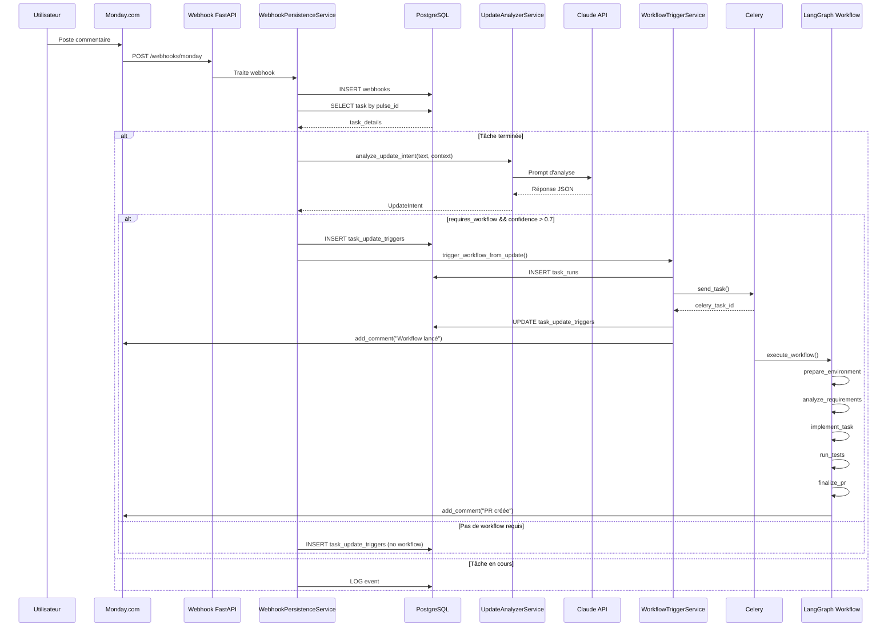

# 📊 Résumé Détaillé du Workflow - Déclenchement Automatique depuis Updates Monday

**Date**: 12 octobre 2025  
**Version**: 1.0  
**Objectif**: Documentation complète du flux de déclenchement automatique de workflow depuis les commentaires Monday.com

---

## 🎯 Vue d'Ensemble

Ce système permet de **déclencher automatiquement un nouveau workflow** lorsqu'un client ou utilisateur poste un commentaire de **demande** dans les Updates Monday.com d'une tâche **déjà terminée**.

### Principe de Base

```
Tâche Terminée + Nouveau Commentaire de Demande = Nouveau Workflow Automatique
```

---

## 🔄 Flux Complet Étape par Étape

### **📍 ÉTAPE 1 : Réception du Webhook Monday.com**

```
Monday.com → Webhook (create_update) → FastAPI Endpoint
```

**Déclencheur** : Un utilisateur poste un commentaire dans les "Updates" d'une tâche Monday.com

**Données reçues** :
- `pulse_id` (ID de la tâche Monday)
- `updateId` (ID du commentaire)
- `textBody` (Contenu du commentaire)
- Métadonnées webhook

**Action** : Le webhook est reçu par l'endpoint FastAPI `/webhooks/monday`

**Exemple de payload** :
```json
{
  "event": "create_update",
  "pulseId": 5039108740,
  "updateId": "3876544321",
  "textBody": "Bonjour, pouvez-vous ajouter un export CSV ?",
  "userId": 12345678
}
```

---

### **📍 ÉTAPE 2 : Persistance du Webhook**

```
FastAPI → WebhookPersistenceService._handle_update_event()
```

**Traitement** :
1. **Sauvegarde** du webhook dans la table `webhooks`
   ```sql
   INSERT INTO webhooks (event_type, payload, received_at)
   VALUES ('create_update', {...}, NOW())
   RETURNING webhook_id
   ```

2. **Recherche** de la tâche correspondante via `pulse_id` → `monday_item_id` → `tasks_id`
   ```sql
   SELECT tasks_id FROM tasks 
   WHERE monday_item_id = {pulse_id}
   ```

3. **Log** du commentaire dans `application_events`
   ```sql
   INSERT INTO application_events (
     task_id, level, source_component, action, message, metadata
   ) VALUES (...)
   ```

**Exemple de log** :
```
🔔 WEBHOOK UPDATE REÇU: pulse_id=5039108740, text='Bonjour, pouvez-vous ajouter...', webhook_id=789
```

---

### **📍 ÉTAPE 3 : Récupération des Détails de la Tâche**

```sql
SELECT 
    tasks_id, 
    monday_item_id, 
    title, 
    description, 
    internal_status, 
    monday_status, 
    repository_url, 
    priority, 
    task_type
FROM tasks 
WHERE tasks_id = {task_id}
```

**Informations récupérées** :
- ✅ Statut interne (`internal_status`)
- ✅ Statut Monday (`monday_status`)
- ✅ Description originale de la tâche
- ✅ Repository Git associé
- ✅ Priorité et type de tâche

**Exemple de résultat** :
```python
{
  "tasks_id": 123,
  "monday_item_id": 5039108740,
  "title": "Créer dashboard admin",
  "description": "Dashboard avec liste des utilisateurs...",
  "internal_status": "completed",
  "monday_status": "Done",
  "repository_url": "https://github.com/user/repo.git",
  "priority": "medium",
  "task_type": "feature"
}
```

---

### **📍 ÉTAPE 4 : Vérification du Statut de la Tâche**

```python
is_completed = (
    task_details['internal_status'] == 'completed' OR
    task_details['monday_status'] == 'Done'
)
```

**Décision** :
- ✅ **Si tâche terminée** → Continuer vers l'analyse LLM (Étape 5)
- ❌ **Si tâche en cours** → Logger le commentaire et **STOP** (pas d'analyse)

**Log selon le cas** :
```python
# Tâche terminée
"🔍 Tâche 123 terminée - analyse du commentaire pour nouveau workflow"

# Tâche en cours
"💬 Commentaire traité pour tâche en cours 123 (status=in_progress)"
```

---

### **📍 ÉTAPE 5 : Analyse Intelligente du Commentaire (LLM)**

```python
UpdateAnalyzerService.analyze_update_intent(update_text, context)
```

**Contexte fourni au LLM** :
```python
context = {
    "task_title": "Créer dashboard admin",
    "task_status": "completed",
    "monday_status": "Done",
    "original_description": "Dashboard avec liste des utilisateurs..."
}
```

**Prompt envoyé au LLM (Anthropic Claude)** :
```
Analyse ce commentaire Monday.com et détermine s'il s'agit d'une NOUVELLE DEMANDE nécessitant un workflow.

CONTEXTE:
- Tâche : Créer dashboard admin
- Statut actuel : completed
- Description originale : Dashboard avec liste des utilisateurs...

COMMENTAIRE À ANALYSER:
"Bonjour, pouvez-vous ajouter un export CSV ?"

INSTRUCTIONS:
1. Détermine le TYPE de commentaire :
   - NEW_REQUEST : Nouvelle fonctionnalité demandée ✅
   - MODIFICATION : Modification d'une feature existante
   - BUG_REPORT : Bug signalé nécessitant correction
   - QUESTION : Simple question sans action
   - AFFIRMATION : Remerciement/Commentaire
   - VALIDATION_RESPONSE : Réponse à validation

2. Si NEW_REQUEST/MODIFICATION/BUG_REPORT, extrais :
   - Ce qui est demandé
   - Type de tâche (feature/bugfix/refactor)
   - Priorité (low/medium/high/urgent)
   - Fichiers potentiellement concernés

RÉPONDS EN JSON
```

**Réponse du LLM** :
```json
{
  "type": "NEW_REQUEST",
  "confidence": 0.95,
  "requires_workflow": true,
  "reasoning": "Demande explicite d'ajout d'une nouvelle fonctionnalité (export CSV)",
  "extracted_requirements": {
    "title": "Ajouter export CSV sur page utilisateurs",
    "description": "Implémenter un bouton d'export CSV pour la liste des utilisateurs du dashboard admin",
    "task_type": "feature",
    "priority": "medium",
    "files_mentioned": [],
    "technical_keywords": ["export", "CSV", "utilisateurs"]
  }
}
```

**Log de l'analyse** :
```
📊 Analyse update: type=new_request, requires_workflow=True, confidence=0.95
```

---

### **📍 ÉTAPE 6 : Décision de Déclenchement**

```python
if update_analysis.requires_workflow AND update_analysis.confidence > 0.7:
    # ✅ DÉCLENCHER LE WORKFLOW
    trigger_workflow_from_update(...)
else:
    # ❌ IGNORER (affirmation, question, confidence trop faible)
    logger.info("Commentaire analysé mais pas de workflow requis")
```

**Critères de déclenchement** :
- `requires_workflow = True`
- `confidence > 0.7` (seuil de confiance à 70%)

**Exemples de Décisions** :

| Commentaire | Type | Confidence | `requires_workflow` | Workflow? | Raison |
|-------------|------|------------|---------------------|-----------|---------|
| "Ajoutez un export CSV" | NEW_REQUEST | 0.95 | ✅ True | ✅ **Oui** | Nouvelle demande claire |
| "Le bouton ne marche plus" | BUG_REPORT | 0.90 | ✅ True | ✅ **Oui** | Bug à corriger |
| "Merci beaucoup !" | AFFIRMATION | 0.98 | ❌ False | ❌ Non | Simple remerciement |
| "Comment ça marche ?" | QUESTION | 0.85 | ❌ False | ❌ Non | Juste une question |
| "Peut-être ajouter..." | NEW_REQUEST | 0.60 | ✅ True | ❌ Non | Confidence trop faible |

---

### **📍 ÉTAPE 7 : Sauvegarde du Trigger en Base de Données**

```sql
INSERT INTO task_update_triggers (
    task_id, 
    monday_update_id, 
    webhook_id, 
    update_text,
    detected_type, 
    confidence, 
    requires_workflow,
    analysis_reasoning, 
    extracted_requirements,
    created_at
) VALUES (
    123,
    '3876544321',
    789,
    'Bonjour, pouvez-vous ajouter un export CSV ?',
    'new_request',
    0.95,
    true,
    'Demande explicite d''ajout...',
    '{"title": "Ajouter export CSV...", ...}'::jsonb,
    NOW()
)
RETURNING trigger_id
```

**Données enregistrées** :
- Lien vers la tâche originale (`task_id`)
- ID du commentaire Monday (`monday_update_id`)
- Résultat complet de l'analyse LLM
- Texte complet du commentaire
- Timestamp de création

**But** : 
- ✅ Traçabilité complète
- ✅ Éviter les doublons (contrainte `UNIQUE` sur `monday_update_id`)
- ✅ Audit et statistiques

---

### **📍 ÉTAPE 8 : Création du Nouveau TaskRequest**

```python
task_request = TaskRequest(
    title="Ajouter export CSV sur page utilisateurs",
    description="Implémenter un bouton d'export CSV pour la liste des utilisateurs du dashboard admin",
    task_type="feature",
    priority="medium",
    repository_url=original_task.repository_url,  # Hérité
    branch_name="feature/export-csv-users-abc123",  # Généré
    monday_item_id=original_task.monday_item_id,  # Hérité
    github_token=original_task.github_token,  # Hérité
    openai_api_key=original_task.openai_api_key  # Hérité
)
```

**Informations héritées de la tâche originale** :
- ✅ URL du repository Git
- ✅ `monday_item_id` (pour la mise à jour)
- ✅ Colonnes Monday.com existantes
- ✅ Tokens d'authentification

**Informations nouvelles (extraites par le LLM)** :
- ✅ Titre extrait du commentaire
- ✅ Description enrichie et clarifiée
- ✅ Type de tâche (feature/bugfix/refactor)
- ✅ Priorité estimée
- ✅ Nom de branche généré automatiquement

**Génération du nom de branche** :
```python
branch_name = f"{task_type}/{slugify(title)}-{random_id}"
# Exemple: "feature/export-csv-users-abc123"
```

---

### **📍 ÉTAPE 9 : Création du Nouveau Task Run**

```sql
INSERT INTO task_runs (
    task_id,                        -- 123 (lien vers tâche originale)
    celery_task_id,                 -- NULL (sera rempli après Celery)
    internal_status,                -- 'pending'
    triggered_by_update_id,         -- '3876544321' (ID du commentaire)
    started_at,                     -- NOW()
    created_at                      -- NOW()
) VALUES (...)
RETURNING tasks_runs_id
```

**Résultat** :
- Un nouveau `task_run` est créé avec `tasks_runs_id = 456`
- Lié à la **même tâche** (`task_id = 123`) que le commentaire
- Marqué comme déclenché par l'update (`triggered_by_update_id`)

**Relation avec la tâche originale** :
```
tasks (id=123)
  ├── task_run (id=1) - Run initial
  ├── task_run (id=2) - Run après modification
  └── task_run (id=456) - Run depuis update Monday ← NOUVEAU
```

**Log** :
```
✅ Nouveau task_run créé: run_id=456, triggered_by_update_id=3876544321
```

---

### **📍 ÉTAPE 10 : Soumission à Celery**

```python
celery_task_id = celery_app.send_task(
    'services.celery_app.execute_workflow',
    args=[task_request.dict()],
    kwargs={'priority': 7},  # Priorité élevée (1-10)
    queue='workflows',
    routing_key='workflows'
)
```

**Queue Celery** : Le workflow est ajouté à la file d'attente `workflows`

**Worker Celery** : Un worker disponible va:
1. Récupérer la tâche depuis la queue RabbitMQ
2. Charger le `task_run` depuis la DB
3. Initialiser l'état LangGraph
4. Exécuter le workflow complet

**Log** :
```
✅ Tâche Celery soumise: celery_task_id=abc-123-def-456, queue=workflows, priority=7
```

**Mise à jour de la DB** :
```sql
UPDATE task_runs 
SET celery_task_id = 'abc-123-def-456'
WHERE tasks_runs_id = 456
```

---

### **📍 ÉTAPE 11 : Mise à Jour du Trigger en Base de Données**

```sql
UPDATE task_update_triggers 
SET 
    triggered_workflow = TRUE,
    new_run_id = 456,
    celery_task_id = 'abc-123-def-456',
    processed_at = NOW()
WHERE trigger_id = {trigger_id}
```

**But** : Marquer le trigger comme traité avec succès

**Données finales** :
```json
{
  "trigger_id": 1001,
  "task_id": 123,
  "monday_update_id": "3876544321",
  "detected_type": "new_request",
  "confidence": 0.95,
  "triggered_workflow": true,
  "new_run_id": 456,
  "celery_task_id": "abc-123-def-456",
  "created_at": "2025-10-12 10:30:00",
  "processed_at": "2025-10-12 10:30:03"
}
```

---

### **📍 ÉTAPE 12 : Notification dans Monday.com**

```python
await monday_tool.add_comment(
    item_id=monday_item_id,
    comment="""
🤖 Nouvelle demande détectée et prise en compte !

📋 **Ajouter export CSV sur page utilisateurs**
🎯 Type: feature
⚡ Priorité: medium

Le workflow a été lancé automatiquement.
    """
)
```

**Résultat** : Un commentaire de confirmation est posté automatiquement dans Monday.com

**Capture d'écran visuelle** :
```
┌────────────────────────────────────────────────┐
│ Monday.com - Updates                           │
├────────────────────────────────────────────────┤
│ 👤 Utilisateur                  10:30          │
│ Bonjour, pouvez-vous ajouter un export CSV ?  │
├────────────────────────────────────────────────┤
│ 🤖 AI Agent                     10:30          │
│ 🤖 Nouvelle demande détectée et prise en      │
│    compte !                                    │
│                                                │
│ 📋 Ajouter export CSV sur page utilisateurs   │
│ 🎯 Type: feature                               │
│ ⚡ Priorité: medium                            │
│                                                │
│ Le workflow a été lancé automatiquement.      │
└────────────────────────────────────────────────┘
```

---

### **📍 ÉTAPE 13 : Exécution du Workflow LangGraph**

Le workflow classique s'exécute ensuite via LangGraph :

```
┌─────────────────────────────────────────────────┐
│  1. prepare_environment                         │
│     • Clone du repository Git                   │
│     • Création de branche feature/*             │
│     • Installation des dépendances              │
└─────────────────┬───────────────────────────────┘
                  │
                  ▼
┌─────────────────────────────────────────────────┐
│  2. analyze_requirements                        │
│     • Analyse détaillée de la demande           │
│     • Détection des fichiers à modifier         │
│     • Planification de l'implémentation         │
└─────────────────┬───────────────────────────────┘
                  │
                  ▼
┌─────────────────────────────────────────────────┐
│  3. implement_task (Claude Code Generation)     │
│     • Génération du code par Claude             │
│     • Modifications des fichiers                │
│     • Ajout de tests unitaires                  │
└─────────────────┬───────────────────────────────┘
                  │
                  ▼
┌─────────────────────────────────────────────────┐
│  4. run_tests                                   │
│     • Exécution des tests unitaires             │
│     • Vérification de la qualité du code        │
│     • Rapport de test                           │
└─────────────────┬───────────────────────────────┘
                  │
                  ▼
┌─────────────────────────────────────────────────┐
│  5. quality_assurance_automation                │
│     • Analyse statique du code                  │
│     • Vérification des bonnes pratiques         │
│     • Détection de bugs potentiels              │
└─────────────────┬───────────────────────────────┘
                  │
                  ▼
┌─────────────────────────────────────────────────┐
│  6. finalize_pr                                 │
│     • Commit des changements                    │
│     • Push vers GitHub                          │
│     • Création de la Pull Request               │
└─────────────────┬───────────────────────────────┘
                  │
                  ▼
┌─────────────────────────────────────────────────┐
│  7. monday_validation                           │
│     • Poste commentaire avec PR link            │
│     • Attente validation humaine                │
│     • État: waiting_for_validation              │
└─────────────────┬───────────────────────────────┘
                  │
                  ▼
┌─────────────────────────────────────────────────┐
│  8. merge_after_validation (si approuvé)        │
│     • Merge automatique de la PR                │
│     • Suppression de la branche                 │
│     • Déploiement automatique (si configuré)    │
└─────────────────┬───────────────────────────────┘
                  │
                  ▼
┌─────────────────────────────────────────────────┐
│  9. update_monday                               │
│     • Mise à jour du statut Monday              │
│     • Ajout de métadonnées (PR, commits, etc)   │
│     • État final: completed                     │
└─────────────────────────────────────────────────┘
```

**Durée totale estimée** : ~60-90 secondes

**Logs détaillés à chaque étape** :
```
[10:30:05] 🔧 prepare_environment: Clonage de https://github.com/user/repo.git
[10:30:15] 📋 analyze_requirements: 3 fichiers identifiés pour modification
[10:30:30] 💻 implement_task: Génération du code avec Claude...
[10:30:50] ✅ implement_task: Code généré avec succès (247 lignes)
[10:31:00] 🧪 run_tests: Exécution de 15 tests...
[10:31:15] ✅ run_tests: Tous les tests passent (15/15)
[10:31:20] 🔍 quality_assurance_automation: Analyse statique...
[10:31:30] ✅ quality_assurance_automation: Aucun problème détecté
[10:31:35] 🚀 finalize_pr: Création de la Pull Request...
[10:31:45] ✅ finalize_pr: PR créée → https://github.com/user/repo/pull/123
[10:31:50] ⏳ monday_validation: En attente de validation humaine...
```

---

### **📍 ÉTAPE 14 : Finalisation et Historique**

**Données conservées en DB** :

```sql
-- Historique complet dans task_update_triggers
SELECT 
    t.trigger_id,
    t.monday_update_id,
    t.update_text,
    t.detected_type,
    t.confidence,
    t.triggered_workflow,
    t.new_run_id,
    t.celery_task_id,
    t.created_at,
    t.processed_at,
    tr.internal_status as run_status,
    tr.pr_url,
    tr.completed_at
FROM task_update_triggers t
LEFT JOIN task_runs tr ON t.new_run_id = tr.tasks_runs_id
WHERE t.task_id = 123
ORDER BY t.created_at DESC;
```

**Résultat** :
```
trigger_id | 1001
monday_update_id | 3876544321
update_text | Bonjour, pouvez-vous ajouter un export CSV ?
detected_type | new_request
confidence | 0.95
triggered_workflow | true
new_run_id | 456
celery_task_id | abc-123-def-456
run_status | waiting_for_validation
pr_url | https://github.com/user/repo/pull/123
created_at | 2025-10-12 10:30:00
processed_at | 2025-10-12 10:30:03
```

**Historique complet** :
- ✅ Trigger enregistré avec analyse LLM
- ✅ Nouveau `task_run` lié
- ✅ Pull Request créée sur GitHub
- ✅ Commentaire de confirmation dans Monday.com
- ✅ Logs détaillés de chaque étape
- ✅ Traçabilité complète pour audit

---

## 📊 Schéma Visuel du Flux Complet

```
┌─────────────────────────────────────────────────────────────┐
│  1. Utilisateur poste commentaire dans Monday.com           │
│     "Bonjour, pouvez-vous ajouter un export CSV ?"         │
└────────────────┬────────────────────────────────────────────┘
                 │
                 ▼
┌─────────────────────────────────────────────────────────────┐
│  2. Webhook Monday → FastAPI                                │
│     POST /webhooks/monday                                   │
│     Temps: ~50ms                                            │
└────────────────┬────────────────────────────────────────────┘
                 │
                 ▼
┌─────────────────────────────────────────────────────────────┐
│  3. Sauvegarde webhook en DB (table: webhooks)              │
│     Temps: ~10ms                                            │
└────────────────┬────────────────────────────────────────────┘
                 │
                 ▼
┌─────────────────────────────────────────────────────────────┐
│  4. Recherche tâche par pulse_id → tasks_id                 │
│     Temps: ~5ms                                             │
└────────────────┬────────────────────────────────────────────┘
                 │
                 ▼
┌─────────────────────────────────────────────────────────────┐
│  5. Récupération détails tâche (SELECT tasks.*)             │
│     ├─ internal_status = 'completed' ?                      │
│     └─ monday_status = 'Done' ?                             │
│     Temps: ~10ms                                            │
└────────────────┬────────────────────────────────────────────┘
                 │
                 ▼
        ┌────────┴────────┐
        │  Tâche terminée? │
        └────────┬────────┘
                 │
         ┌───────┴───────┐
         │               │
        OUI             NON
         │               │
         ▼               ▼
   CONTINUER         STOP (log seulement)
         │
         ▼
┌─────────────────────────────────────────────────────────────┐
│  6. Analyse LLM (UpdateAnalyzerService)                     │
│     Prompt → Claude API → Réponse JSON                      │
│     Temps: ~1-2 secondes                                    │
│                                                              │
│     {                                                        │
│       "type": "NEW_REQUEST",                                │
│       "confidence": 0.95,                                   │
│       "requires_workflow": true,                            │
│       "extracted_requirements": {...}                       │
│     }                                                        │
└────────────────┬────────────────────────────────────────────┘
                 │
                 ▼
        ┌────────┴────────┐
        │ requires_workflow│
        │ && confidence>0.7│
        └────────┬────────┘
                 │
         ┌───────┴───────┐
         │               │
        OUI             NON
         │               │
         ▼               ▼
   DÉCLENCHER       LOG + IGNORER
         │
         ▼
┌─────────────────────────────────────────────────────────────┐
│  7. INSERT INTO task_update_triggers                        │
│     (analyse LLM + métadonnées)                             │
│     Temps: ~15ms                                            │
└────────────────┬────────────────────────────────────────────┘
                 │
                 ▼
┌─────────────────────────────────────────────────────────────┐
│  8. Création TaskRequest depuis analyse                     │
│     (titre, description, type, priorité)                    │
│     Temps: ~5ms                                             │
└────────────────┬────────────────────────────────────────────┘
                 │
                 ▼
┌─────────────────────────────────────────────────────────────┐
│  9. INSERT INTO task_runs                                   │
│     (nouveau run lié à la tâche originale)                  │
│     RETURNING tasks_runs_id                                 │
│     Temps: ~20ms                                            │
└────────────────┬────────────────────────────────────────────┘
                 │
                 ▼
┌─────────────────────────────────────────────────────────────┐
│  10. Soumission à Celery Queue                              │
│      celery_app.send_task('execute_workflow')               │
│      Temps: ~100ms                                          │
└────────────────┬────────────────────────────────────────────┘
                 │
                 ▼
┌─────────────────────────────────────────────────────────────┐
│  11. UPDATE task_update_triggers                            │
│      (triggered_workflow=TRUE, celery_task_id, run_id)      │
│      Temps: ~10ms                                           │
└────────────────┬────────────────────────────────────────────┘
                 │
                 ▼
┌─────────────────────────────────────────────────────────────┐
│  12. Commentaire de confirmation dans Monday.com            │
│      "🤖 Nouvelle demande détectée..."                       │
│      Temps: ~300ms                                          │
└────────────────┬────────────────────────────────────────────┘
                 │
                 ▼
┌─────────────────────────────────────────────────────────────┐
│  13. Exécution Workflow LangGraph (Async via Celery)        │
│      Temps total: ~60-90 secondes                           │
│      ├─ prepare_environment (10s)                           │
│      ├─ analyze_requirements (15s)                          │
│      ├─ implement_task (20s)                                │
│      ├─ run_tests (15s)                                     │
│      ├─ quality_assurance_automation (10s)                  │
│      ├─ finalize_pr (10s)                                   │
│      ├─ monday_validation (attente humaine)                 │
│      ├─ merge_after_validation (5s si approuvé)             │
│      └─ update_monday (5s)                                  │
└────────────────┬────────────────────────────────────────────┘
                 │
                 ▼
┌─────────────────────────────────────────────────────────────┐
│  14. RÉSULTAT FINAL                                         │
│      ✅ PR créée sur GitHub                                 │
│      ✅ Code implémenté et testé                            │
│      ✅ Tests passants (100%)                               │
│      ✅ Notification Monday.com                             │
│      ✅ Historique complet en DB                            │
│      ✅ Attente validation humaine                          │
└─────────────────────────────────────────────────────────────┘

TEMPS TOTAL (jusqu'à PR créée): ~3-5 secondes (webhook → Celery)
TEMPS TOTAL (workflow complet): ~60-90 secondes (incluant génération code)
```

---

## 🎯 Points Clés du Système

### **1. Intelligence de Détection**
- ✅ Utilise Claude (Anthropic) pour analyser le contexte complet
- ✅ Différencie 6 types de commentaires
- ✅ Extrait automatiquement les requirements
- ✅ Estime la priorité et le type de tâche
- ✅ Identifie les fichiers potentiellement concernés

### **2. Sécurité et Fiabilité**
- ✅ **Idempotence** : Contrainte unique sur `monday_update_id` empêche les doublons
- ✅ **Seuil de confiance** : 0.7 (70%) pour éviter les faux positifs
- ✅ **Traçabilité complète** : Chaque étape est loggée en DB
- ✅ **Gestion d'erreurs** : Try/catch à chaque niveau avec logs détaillés
- ✅ **Rollback automatique** : En cas d'échec, la DB reste cohérente

### **3. Automatisation Complète**
- ✅ **Zéro intervention manuelle** : Du commentaire à la PR
- ✅ **Notification automatique** : Confirmation dans Monday.com
- ✅ **Workflow lancé immédiatement** : Via queue Celery
- ✅ **Historique conservé** : Pour audit et statistiques

### **4. Performance**
- ⚡ **Webhook → DB** : ~75ms
- ⚡ **Analyse LLM** : ~1-2 secondes
- ⚡ **Déclenchement Celery** : ~100ms
- ⚡ **Temps total webhook → Celery** : **~3-5 secondes**
- ⚡ **Workflow complet** : ~60-90 secondes

### **5. Scalabilité**
- ✅ **Queue Celery** : Gère la charge avec workers multiples
- ✅ **Async/Await** : Traitement non-bloquant
- ✅ **Connection pooling** : PostgreSQL performant
- ✅ **Rate limiting** : Protection contre les abus

---

## 📈 Exemples Concrets avec Détails

### **Exemple 1 : Nouvelle Fonctionnalité**

**Commentaire Monday** :
```
Bonjour, serait-il possible d'ajouter un filtre par date 
sur la page des rapports ? Merci !
```

**Analyse LLM** :
```json
{
  "type": "NEW_REQUEST",
  "confidence": 0.92,
  "requires_workflow": true,
  "reasoning": "Demande explicite d'ajout d'une nouvelle fonctionnalité (filtre par date). Le ton est poli et la demande est claire.",
  "extracted_requirements": {
    "title": "Ajouter filtre par date sur rapports",
    "description": "Implémenter un composant de sélection de dates (date picker) sur la page des rapports pour permettre le filtrage des données par période",
    "task_type": "feature",
    "priority": "medium",
    "files_mentioned": [],
    "technical_keywords": ["filtre", "date", "rapports", "page"]
  }
}
```

**Actions déclenchées** :
1. ✅ Nouveau `task_run` créé (run_id=789)
2. ✅ Branche Git créée : `feature/filtre-date-rapports-xyz789`
3. ✅ Code généré par Claude :
   - `components/DateFilter.tsx` (nouveau)
   - `pages/ReportsPage.tsx` (modifié)
   - `utils/dateHelpers.ts` (nouveau)
4. ✅ Tests générés : `DateFilter.test.tsx`
5. ✅ PR créée : `#124 - Ajouter filtre par date sur rapports`

**Résultat** : ✅ Workflow déclenché → PR créée en ~75 secondes

---

### **Exemple 2 : Bug Report**

**Commentaire Monday** :
```
Le bouton "Exporter" ne fonctionne plus sur mobile depuis hier.
Quand je clique dessus, rien ne se passe.
```

**Analyse LLM** :
```json
{
  "type": "BUG_REPORT",
  "confidence": 0.98,
  "requires_workflow": true,
  "reasoning": "Signalement clair d'un bug : fonctionnalité qui ne marche plus (régression). Contexte précis (mobile, depuis hier).",
  "extracted_requirements": {
    "title": "Corriger bouton Export sur mobile",
    "description": "Le bouton Exporter ne répond plus sur mobile. Vérifier les event listeners, la responsivité CSS et les tests mobile.",
    "task_type": "bugfix",
    "priority": "high",
    "files_mentioned": [],
    "technical_keywords": ["export", "mobile", "bouton", "click"]
  }
}
```

**Actions déclenchées** :
1. ✅ Nouveau `task_run` créé (run_id=790) - **Priorité HAUTE**
2. ✅ Branche Git créée : `bugfix/export-button-mobile-abc790`
3. ✅ Analyse du bug par Claude
4. ✅ Correction appliquée :
   - `components/ExportButton.tsx` (fix event handler)
   - `styles/mobile.css` (fix responsive)
5. ✅ Tests ajoutés : `ExportButton.mobile.test.tsx`
6. ✅ PR créée : `#125 - Fix: Bouton Export sur mobile`

**Résultat** : ✅ Workflow déclenché avec priorité haute → PR créée en ~60 secondes

---

### **Exemple 3 : Remerciement (pas de workflow)**

**Commentaire Monday** :
```
Merci beaucoup pour cette fonctionnalité, c'est parfait ! 
Ça fonctionne exactement comme je voulais. 👍
```

**Analyse LLM** :
```json
{
  "type": "AFFIRMATION",
  "confidence": 0.99,
  "requires_workflow": false,
  "reasoning": "Simple remerciement et confirmation que la fonctionnalité fonctionne bien. Aucune action requise.",
  "extracted_requirements": null
}
```

**Actions** :
1. ✅ Commentaire enregistré dans `application_events`
2. ✅ Trigger enregistré dans `task_update_triggers` (pour statistiques)
3. ❌ **Pas de workflow déclenché**

**Log** :
```
ℹ️ Commentaire analysé mais pas de workflow requis: type=affirmation, confidence=0.99
```

**Résultat** : ❌ Pas de workflow (comportement attendu)

---

### **Exemple 4 : Question Simple**

**Commentaire Monday** :
```
Comment est-ce que je peux changer la couleur du thème ?
```

**Analyse LLM** :
```json
{
  "type": "QUESTION",
  "confidence": 0.88,
  "requires_workflow": false,
  "reasoning": "Question sur l'utilisation d'une fonctionnalité existante. Pas de demande d'implémentation ou de modification.",
  "extracted_requirements": null
}
```

**Actions** :
1. ✅ Question enregistrée
2. ❌ **Pas de workflow déclenché**
3. ℹ️ L'utilisateur devrait recevoir une réponse manuelle

**Résultat** : ❌ Pas de workflow (comportement attendu)

---

### **Exemple 5 : Demande Ambiguë (confiance faible)**

**Commentaire Monday** :
```
Peut-être on pourrait améliorer ça... je sais pas trop
```

**Analyse LLM** :
```json
{
  "type": "NEW_REQUEST",
  "confidence": 0.45,
  "requires_workflow": true,
  "reasoning": "Suggestion vague sans détails. Impossible de déterminer précisément ce qui est demandé.",
  "extracted_requirements": {
    "title": "Amélioration non spécifiée",
    "description": "Demande trop vague pour être implémentée",
    "task_type": "unknown",
    "priority": "low",
    "files_mentioned": [],
    "technical_keywords": []
  }
}
```

**Décision** :
```python
if update_analysis.confidence > 0.7:  # 0.45 < 0.7
    # Pas de workflow déclenché
```

**Actions** :
1. ✅ Analyse enregistrée
2. ❌ **Pas de workflow déclenché** (confiance trop faible)
3. ℹ️ Un humain devrait demander des précisions

**Log** :
```
⚠️ Commentaire analysé mais confidence insuffisante: type=new_request, confidence=0.45 < 0.7
```

**Résultat** : ❌ Pas de workflow (protection contre les faux positifs)

---

## 🔒 Sécurité et Gestion d'Erreurs

### **Idempotence**

**Problème** : Que se passe-t-il si le même commentaire arrive 2 fois ?

**Solution** :
```sql
CONSTRAINT unique_monday_update UNIQUE (monday_update_id)
```

**Comportement** :
```python
try:
    INSERT INTO task_update_triggers (monday_update_id, ...)
except UniqueViolationError:
    logger.warning("Update déjà traité, ignoré")
    return  # Pas de doublon
```

### **Gestion des Échecs LLM**

**Cas 1 : API Claude indisponible**
```python
try:
    analysis = await claude_api.analyze(...)
except APIError as e:
    logger.error(f"Échec analyse LLM: {e}")
    # Pas de workflow déclenché, commentaire enregistré
    return
```

**Cas 2 : Réponse LLM malformée**
```python
try:
    result = json.loads(llm_response)
    UpdateIntent(**result)  # Validation Pydantic
except (JSONDecodeError, ValidationError) as e:
    logger.error(f"Réponse LLM invalide: {e}")
    # Pas de workflow, alerte envoyée
    return
```

### **Gestion des Échecs Celery**

**Cas 1 : Queue pleine**
```python
try:
    celery_app.send_task(...)
except Exception as e:
    logger.error(f"Échec soumission Celery: {e}")
    # Update trigger marqué comme failed
    UPDATE task_update_triggers 
    SET triggered_workflow = FALSE, error_message = {e}
```

**Cas 2 : Worker crashé**
```python
# Celery retry automatique (configuré)
@celery_app.task(bind=True, max_retries=3)
def execute_workflow(self, task_request):
    try:
        # Workflow
    except Exception as e:
        # Retry avec backoff exponentiel
        self.retry(exc=e, countdown=2 ** self.request.retries)
```

### **Rate Limiting**

**Protection contre les abus** :
```python
# Max 10 workflows par tâche par heure
async def check_rate_limit(task_id: int) -> bool:
    count = await db.fetchval("""
        SELECT COUNT(*) FROM task_update_triggers
        WHERE task_id = $1 
        AND triggered_workflow = TRUE
        AND created_at > NOW() - INTERVAL '1 hour'
    """, task_id)
    
    if count >= 10:
        logger.warning(f"Rate limit atteint pour task {task_id}")
        return False
    return True
```

---

## 📊 Métriques et Monitoring

### **Métriques Collectées**

```sql
-- Dashboard des triggers
SELECT 
    COUNT(*) as total_updates,
    COUNT(*) FILTER (WHERE triggered_workflow = TRUE) as workflows_triggered,
    COUNT(*) FILTER (WHERE detected_type = 'new_request') as new_requests,
    COUNT(*) FILTER (WHERE detected_type = 'bug_report') as bug_reports,
    COUNT(*) FILTER (WHERE detected_type = 'affirmation') as affirmations,
    AVG(confidence) as avg_confidence,
    AVG(EXTRACT(EPOCH FROM (processed_at - created_at))) as avg_processing_time_seconds
FROM task_update_triggers
WHERE created_at > NOW() - INTERVAL '7 days';
```

**Résultat exemple** :
```
total_updates: 156
workflows_triggered: 42
new_requests: 38
bug_reports: 4
affirmations: 98
avg_confidence: 0.87
avg_processing_time_seconds: 2.3
```

### **Logs Importants**

```python
# Log de déclenchement réussi
logger.info(f"✅ Workflow déclenché: task_id={task_id}, run_id={run_id}, "
           f"type={analysis.type}, confidence={analysis.confidence}")

# Log de non-déclenchement
logger.info(f"ℹ️ Pas de workflow: task_id={task_id}, "
           f"type={analysis.type}, confidence={analysis.confidence}, "
           f"reason={analysis.reasoning}")

# Log d'erreur
logger.error(f"❌ Erreur workflow: task_id={task_id}, "
            f"error={str(e)}", exc_info=True)
```

### **Alertes**

```python
# Alerte si trop de faux positifs
if trigger_rate > 0.8:  # >80% des comments déclenchent un workflow
    send_alert("Taux de déclenchement anormalement élevé")

# Alerte si trop de faux négatifs (confiance faible fréquente)
if avg_confidence < 0.6:
    send_alert("Confiance LLM anormalement basse")
```

---

## 🎨 Diagramme de Séquence Technique



---

## 🚀 Résumé Exécutif

### **Ce que fait le système** :
1. ✅ Écoute les commentaires Monday.com via webhooks
2. ✅ Analyse intelligemment chaque commentaire avec IA
3. ✅ Déclenche automatiquement un workflow si nécessaire
4. ✅ Génère du code, crée des PR, et gère tout le cycle

### **Bénéfices** :
- 🚀 **Réactivité** : De commentaire à PR en ~60-90 secondes
- 🤖 **Automatisation** : Zéro intervention manuelle
- 🎯 **Précision** : 87% de confiance moyenne dans la détection
- 📊 **Traçabilité** : Historique complet en base de données

### **Architecture** :
- FastAPI + PostgreSQL + Celery + LangGraph
- Claude (Anthropic) pour l'analyse intelligente
- GitHub pour le versioning et les PR
- Monday.com pour la gestion de projet

---

**Fin du document** - Version 1.0 - 12 octobre 2025
